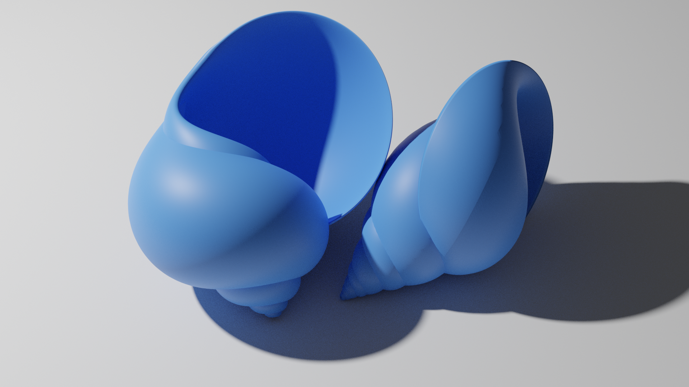

# Shellz

A Blender addon for parametric seashell models. Currently in a semi-working state.

## Todo:

Modelling the seashell using a 16-parameter (?) model.
Generating pigmentation by solving a diffusion equation.

## Keywords

1. Helico-spiral. The central spiral which defines the "spiraling" of the sea shell.
2. Generating curve. The generating curve represents the shape that is extruded along the helico-spiral, with a diminishing size. We ideally use
a closed parametric spline curve for this, as it allows local control, and easy interpretation due to the single parameter.
3. Frenet frame. A reference system well suited for representing orientation, as it does not depend on the parametrization
of the Helico-spiral nor on the specific coordinates it is represented in.

## Sources

http://academics.smcvt.edu/jellis-monaghan/papers/papers/teaching%20papers/AE-MKMpre.pdf

http://algorithmicbotany.org/papers/shells.sig92.pdf

http://www.mat.uc.pt/~picado/conchas/eng/article.pdf
